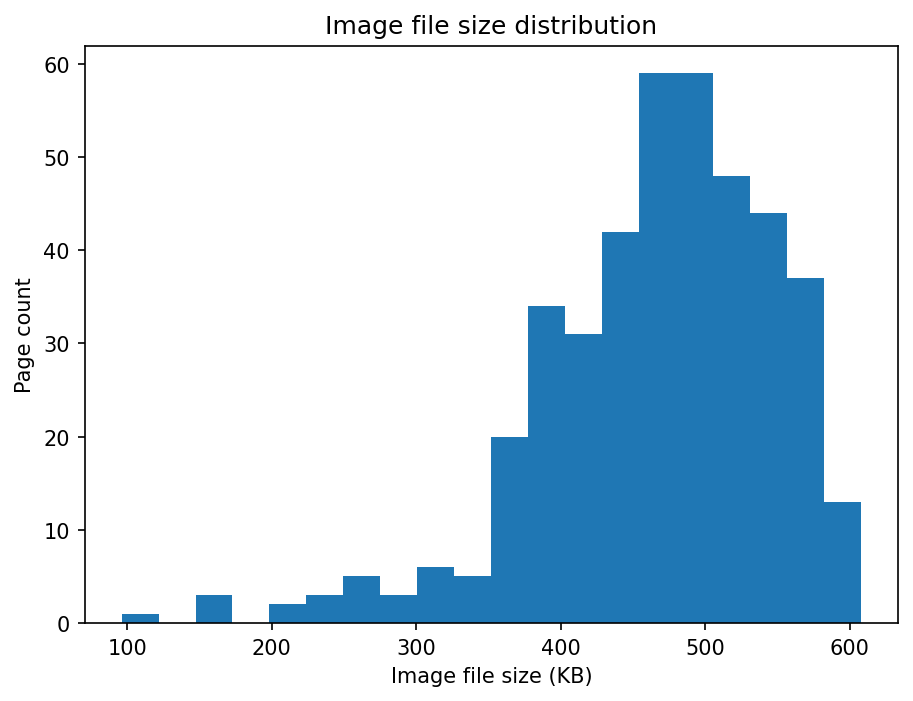
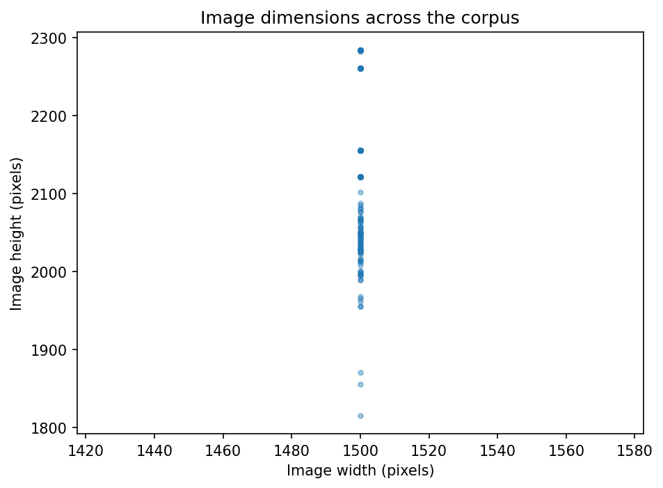
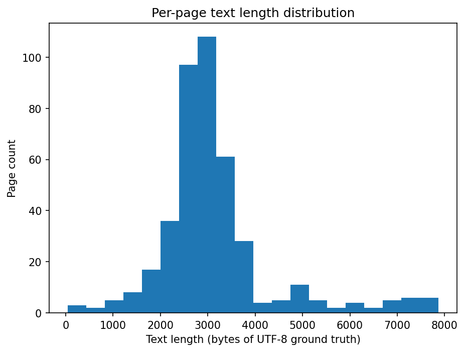
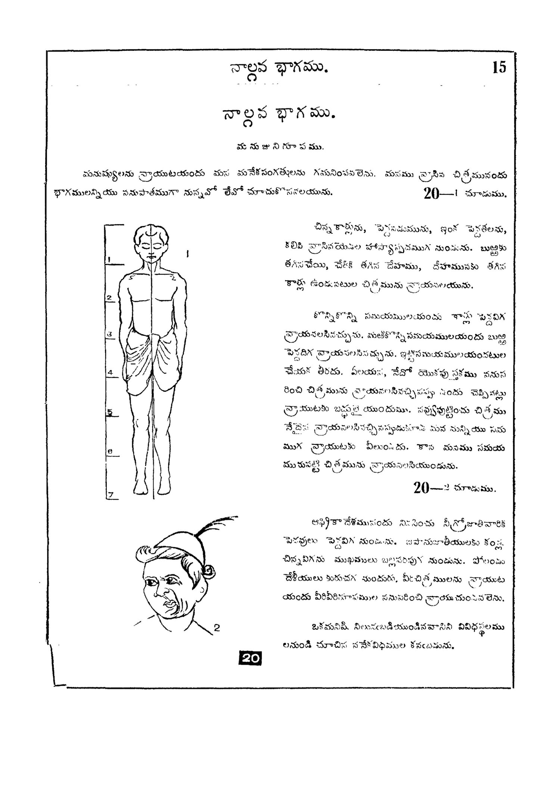
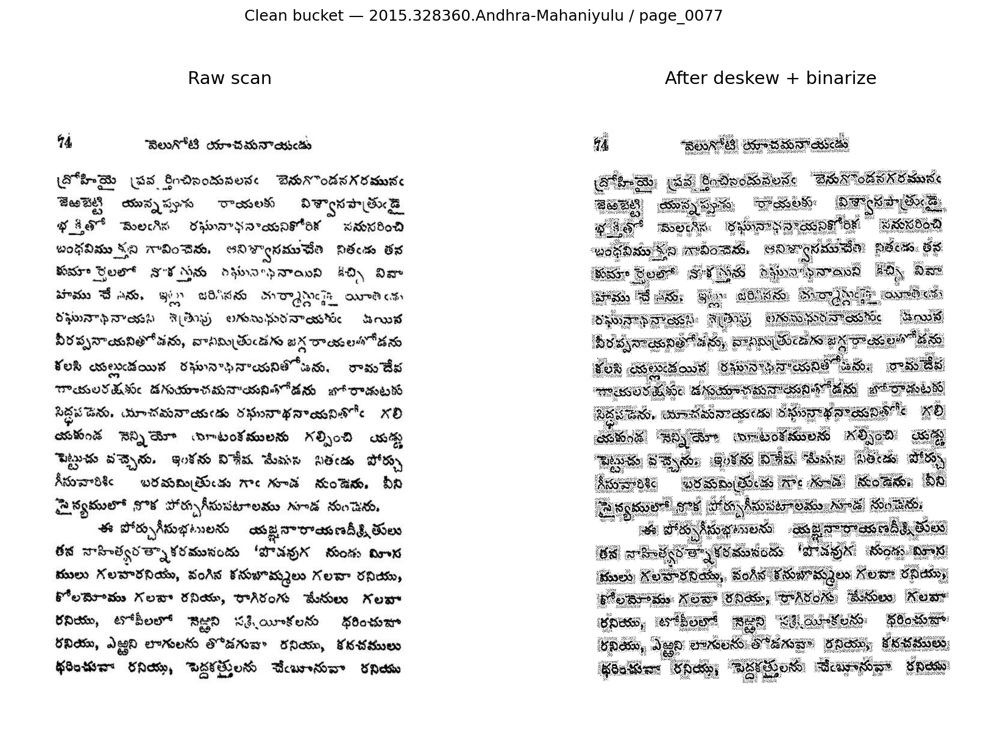
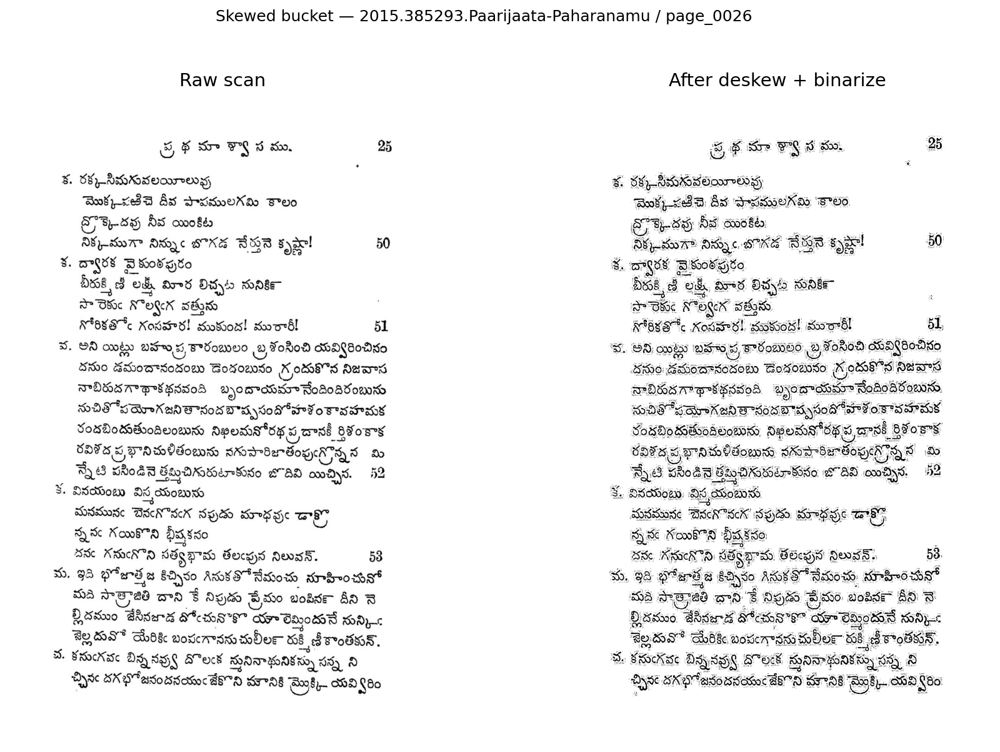
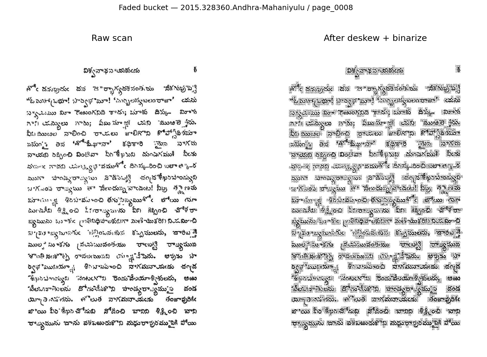
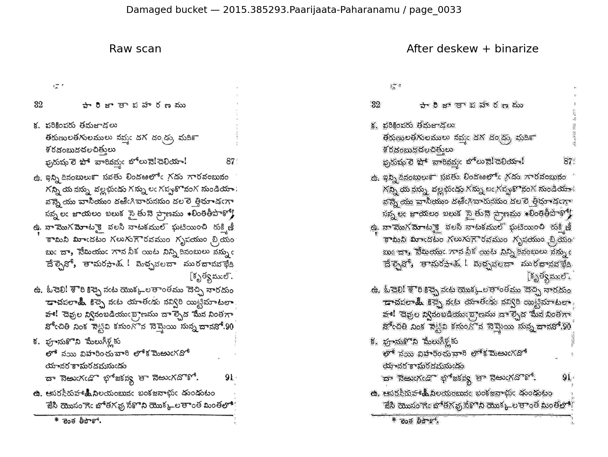
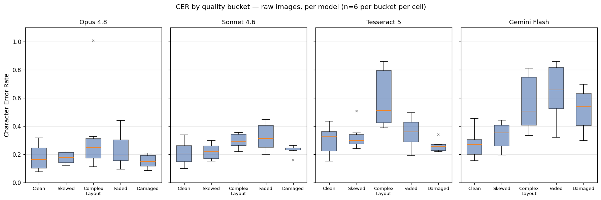
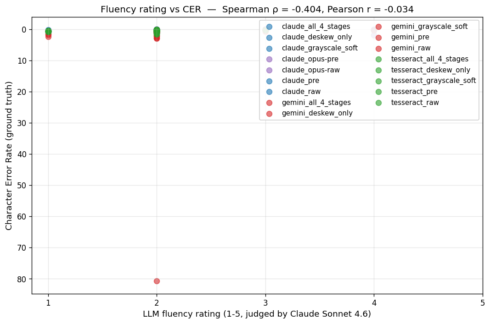

# Abstract {.unnumbered}

We built an end-to-end Telugu OCR pipeline comparing four OCR systems — Tesseract 5 (classical), Google Gemini 2.5 Flash, Anthropic Claude Sonnet 4.6, and Anthropic Claude Opus 4.8 — across up to five image-preprocessing variants on a 30-page evaluation subset stratified by image quality. Beyond the model comparison, we developed an LLM-based validation framework that estimates OCR quality without ground truth via fluency scoring and cross-model agreement.

Three empirical findings emerged from a **510-row CER/WER matrix** (4 OCR systems × 5 preprocessing variants on the eval subset, with Opus only on raw + preprocessed for cost reasons):

1. **Binarization is universally harmful; other preprocessing is model-dependent.** A per-stage ablation across five variants (raw, deskew-only, deskew+denoise+contrast "grayscale-soft", deskew+binarize, and all 4 stages) shows that the binarize stage hurts every model tested — including the classical Tesseract baseline (+21 pp CER versus raw). However, the three grayscale-preserving stages (deskew, CLAHE-based contrast enhancement, and non-local-means denoising) help some models and hurt others: Claude Sonnet and Tesseract are both BEST under the grayscale-soft variant, while Gemini Flash is best under raw and is hurt by both contrast and denoising. The right preprocessing is per-model-class, not universal.
2. **Claude Sonnet 4.6 is the cost-quality sweet spot.** Opus 4.8 is only ~1 percentage point better on mean CER for 7× the cost, while Gemini Flash 2.5 is ~28 percentage points worse than either Claude model.
3. **The classical Tesseract baseline beat Gemini Flash by 18 percentage points** on Telugu, demonstrating that vision LLMs are not automatically superior to classical methods for low-resource scripts.

We also produced a 524+ page submission sample (over the spec's 500-page minimum) using Gemini 2.5 Flash. Total API spend across the project: approximately \$10.

The report is organized around the *process* of producing these findings rather than the findings alone, in line with the instructor's guidance in Announcement 3 that documenting iteration matters more than the final result.

---

# Introduction

## Problem statement

Telugu is one of the Dravidian languages of South India, spoken by approximately 80 million people. Its script is rich in compound characters (sanyukatakshara), vowel diacritics that attach to base consonants, and stylized typographic conventions in historical printed texts. Optical character recognition (OCR) for Telugu, particularly on degraded historical scans, has historically been a difficult problem: low-resource language training data, limited public benchmarks, and complex script topology combine to make it a hard test case for general-purpose OCR systems.

Recent multimodal large language models — Google Gemini, Anthropic Claude, OpenAI GPT-4o, and others — are trained on diverse image-text pairs and have shown competence at OCR-style tasks without explicit OCR fine-tuning. This raises a natural question for a low-resource language like Telugu: **do vision LLMs outperform classical OCR baselines, and if so, by how much, at what cost?**

This project's contribution is empirical: we built a pipeline that runs four OCR systems against the same 30-page stratified subset, scored each against ground truth, and identified the specific conditions under which preprocessing helps or hurts. We also built two ground-truth-free quality estimators (LLM fluency scoring and cross-model agreement) and calibrated them against the CER measurements on the eval subset.

## Scope and what this report is NOT

We do not propose a new OCR algorithm. We do not fine-tune any of the models we compare. We do not test on languages other than Telugu. The contribution is a defensible empirical comparison and a documented iteration trail.

The instructor's Announcement 3 explicitly states: *"performance improvements often come not from inventing a new algorithm, but from making better decisions about data preparation, model selection, workflow design, evaluation methodology, and parameter tuning."* This report is structured around that framing.

## Contributions

1. A reproducible pipeline (`scripts/run_ocr.py` + `src/ocr/*`) that runs Tesseract, Gemini Flash, Claude Sonnet, and Claude Opus over the same input set under the same evaluation contract.
2. A 510-row CER/WER matrix (`data/processed/eval_subset/cer_wer.csv`) computed over four models × up to five preprocessing variants × 30 stratified pages (Opus only on two variants for cost reasons).
3. A 524+ page submission sample of the 6-book corpus via Gemini Flash (over the spec's 500-page minimum).
4. An LLM-based validation framework (`src/validation/`) implementing classical CER/WER, cross-model agreement scoring, and LLM fluency rating with a calibration analysis against ground truth.
5. A documented iteration narrative (Section 7) capturing the pivots, scope compressions, and empirical surprises encountered during the four-day implementation window.

---

# Background

## Telugu OCR — what makes it hard

Telugu is a Dravidian language with roughly 80 million speakers, concentrated in the Indian states of Andhra Pradesh and Telangana. Its writing system is an abugida — a consonant-vowel syllabic script descended from Brahmi — in which each base consonant carries an inherent vowel that attached marks then modify. Three properties make the script harder to recognize than Latin text. Compound characters (sanyuktakshara) are formed by stacking two or more consonants vertically into a single ligature, so the visual unit does not correspond to a linear sequence of glyphs. Vowel marks (matras) attach above, below, before, or after the base consonant, and one syllable can combine several of them. The resulting conjuncts do not decompose cleanly into a left-to-right character stream, which breaks the segmentation assumptions that OCR engines built for alphabetic scripts rely on [@sharma2020indic].

The corpus used here consists of historical Telugu printed books, which carry the degradation typical of aged scans: faded ink, paper damage, page skew, and photocopy-noise patterns. The typography adds a long tail of non-text artifacts — ornamental section dividers, English-digit page and verse numbers interleaved with Telugu prose, and decorative borders — that a recognizer must distinguish from genuine content rather than treat as defects. Compounding these difficulties, Telugu remains low-resource in OCR research relative to Latin or the major East Asian scripts, with fewer public benchmarks and less labeled training data available [@sharma2020indic].

## Vision-language models for OCR

Recent multimodal large language models — Google Gemini [@gemini25flash], Anthropic Claude [@claudesonnet46], OpenAI GPT-4o, and Qwen-VL — are trained on diverse image-text pairs at web scale. A notable property of that training is capability transfer: these models perform OCR-like tasks competently without explicit OCR fine-tuning, reading text directly from images as a byproduct of general vision-language pretraining. For low-resource languages, however, performance varies widely, and downstream OCR accuracy tracks how well the target language is represented in the training data. The practical appeal is an accessibility shift: a vision LLM lowers the engineering cost of standing up an OCR pipeline — no model training, no classical-OCR parameter tuning — which makes these models attractive for one-off digitization projects where building a bespoke recognizer would not be justified.

## Classical OCR: Tesseract

Tesseract is an open-source OCR engine that originated at HP Labs in 1985, was released as open source under Google's stewardship in 2005, and has since matured to a 5.x line built on an LSTM neural recognition backbone [@smith2007tesseract]. The engine performs its own image preprocessing before recognition, including Otsu's global thresholding [@otsu1979] and Sauvola-style local adaptive thresholding [@sauvola2000adaptive] for binarization — preprocessing tuned to the demands of its downstream recognizer. Telugu is supported through a dedicated language pack (the `tesseract-ocr-tel` package on Ubuntu), trained on a curated Telugu corpus by the Tesseract community. Accuracy nonetheless varies substantially across Indic scripts: Tesseract performs well on Devanagari but degrades on the conjunct-heavy Dravidian scripts, where the vertically stacked ligatures described above defeat the segmentation and recognition assumptions that hold for simpler alphabets.

## LLM-based validation without ground truth

Using a language model to evaluate another model's output — the "LLM-as-judge" framing — has become a standard technique in NLP evaluation [@zheng2023judging]. We implement two complementary, ground-truth-free variants. Method A, fluency scoring (Phase 4 Task 3), asks a vision LLM to rate an OCR output for its naturalness as Telugu prose, on the premise that a faithful transcription reads as fluent text while a degraded one does not. Method B, cross-model agreement, scores two independent OCR readings of the same page by character-level similarity (`difflib.SequenceMatcher`), treating convergence between models as a proxy for page difficulty. Because neither method requires reference text, both can be applied at scale to unlabeled corpora — the exact situation in Phase 5, where we hold 415 pages of Gemini output but ground truth only for the 30-page eval subset. Calibrating both proxies against ground-truth CER on that subset (Phase 4 Task 5) is what establishes whether they actually track transcription quality.

---

# Data

## Corpus

The corpus is `AlbertoChestnut/telugu-ocr`, a public HuggingFace dataset of approximately 221 books and ~13 GB of paired Telugu page images and ground-truth Unicode text. We pinned upstream commit `f2bd895b...` in `scripts/download_dataset.py` so every team member and any reproducer gets the exact same files.

For the eval matrix we work with a 5-book, 415-page subset (chosen for iteration speed within the four-day delivery window). For the submission sample we added a 6th book (ASHOKUDU, 242 pages) to clear the spec's 500-page minimum, bringing the total submission corpus to 657 paired pages. Both subset choices are disclosed and discussed in Section 9 (Limitations).

| Book ID | Pages |
|---------|------:|
| `Kalidasa-Charitra_by_chilakamarthi_lakshminarasimham` | 133 |
| `2015.385293.Paarijaata-Paharanamu` | 110 |
| `2015.389095.Shabhuka-Vadha` | 75 |
| `2015.328360.Andhra-Mahaniyulu` | 60 |
| `2030020025431_-_chitra_leikhanamu` | 37 |
| **Total** | **415** |

: The 5-book subset, with per-book page counts. Full per-page inventory at `data/external/corpus_inventory.csv` (image dimensions, file sizes, paired text length). {#tbl-corpus-inventory}

The full corpus characterization is given in our Phase 1 deliverable, `reports/corpus_characterization.qmd`, including image-dimension distributions, file-size distributions, page-text-length distributions, and the DPI estimate.

::: {#fig-corpus-distributions layout-ncol=1}
{#fig-file-size width="85%"}

{#fig-image-dim width="85%"}

{#fig-text-len width="85%"}

Three distribution plots from the Phase 1 corpus characterization.
:::

## Quality taxonomy

We tagged 97 pages by hand into five quality buckets, then drew the 30-page evaluation subset by stratified random sampling (6 pages per bucket).

| Bucket | Description | Per-bucket count |
|--------|-------------|------------------|
| Clean | Sharp scan, no skew, no fading, simple layout | 6 |
| Skewed | Visible rotation; characters intact | 6 |
| Faded | Reduced contrast; faint character strokes | 6 |
| Complex Layout | Multi-column, ornamental dividers, decorative borders | 6 |
| Damaged | Physical damage, missing content, torn pages | 6 |

::: {#fig-quality-examples layout-ncol=3}
{#fig-clean width="100%"}

{#fig-skewed width="100%"}

{#fig-faded width="100%"}

{#fig-complex width="100%"}

{#fig-damaged width="100%"}

One example page per quality bucket from the eval subset.
:::

The taxonomy emerged from browsing the data rather than from an a-priori spec. Two discoveries during the browse changed our analytical methodology:

1. **All images in our 5-book subset are exactly 1500 pixels wide.** The "DPI distribution" we had planned to report collapsed to a single value (~250 DPI based on a typical 6-inch printed book width). The corpus-stats JSON records `image_width_uniform: true`.
2. **Telugu publishing-specific features.** Ornamental section dividers (rows of stars/dots), numbered verses in English digits, and decorative borders are NOT quality defects but standard typography. Disambiguating these from genuine layout complexity required judgment we did not anticipate.

These observations are themselves an iteration finding and are discussed in Section 7.

## Evaluation subset construction

`scripts/select_eval_subset.py` draws 6 pages from each quality bucket using a fixed random seed (42), producing `data/external/eval_subset.csv` and a frozen directory of 30 paired image-and-truth files at `data/external/eval_subset/`. The subset is committed to git so every downstream phase scores against the same pages.

---

# Methodology

## Preprocessing pipeline

`src/preprocessing/pipeline.py` exposes a composable two-stage pipeline:

1. **Deskew** — `src.preprocessing.deskew` estimates the dominant rotation angle via projection-profile analysis and counter-rotates to within ±0.5°. The rotation interpolation is bilinear; the canvas is white-padded so corners remain consistent.
2. **Binarize** — OpenCV [@bradski2000opencv] `cv2.adaptiveThreshold` with `block_size=11, c=2` (mean Gaussian neighborhood, subtractive constant), Gaussian local adaptive thresholding. Output is single-channel uint8 with two values: 0 (text) and 255 (background).
3. **Denoise** (added during the Phase 5 ablation; see Section 6.3) — OpenCV `cv2.fastNlMeansDenoising` with `h=7`, `templateWindowSize=7`, `searchWindowSize=21`. Edge-preserving non-local means filter, tuned to preserve thin Telugu strokes.
4. **Contrast** (added during the Phase 5 ablation; see Section 6.3) — Contrast Limited Adaptive Histogram Equalization [@zuiderveld1994clahe] via OpenCV `cv2.createCLAHE` with `clipLimit=2.0`, `tileGridSize=(8,8)`. For BGR input we convert to LAB color space and CLAHE the L channel only to avoid per-channel color shift.

::: {#fig-preprocessing layout-ncol=2}
{width="100%"}

{width="100%"}

{width="100%"}

{width="100%"}

Before/after the two-stage preprocessing pipeline (deskew + binarize), one per quality bucket where the effect is visible.
:::

Stages 1 and 2 (deskew + binarize) shipped in the Phase 2 deliverable. Stages 3 and 4 (denoise + contrast) were originally deferred for time, then implemented late in Phase 5 to support the per-stage ablation (see Section 6.3). All four stages are now part of `src/preprocessing/`, with per-stage enable/disable via `Pipeline.run(..., enable={...})` so any subset can be applied to test specific hypotheses.

## OCR adapters

`src/ocr/` defines an `OCRAdapter` Protocol that every backend satisfies:

```python
class OCRAdapter(Protocol):
    model_name: str
    def ocr(self, image_path: Path) -> OCRResult: ...
```

Four implementations:

- `src.ocr.tesseract.TesseractAdapter` — wraps the pinned `ml-class-project/tesseract` Docker image (Tesseract 5, Telugu language pack, PSM 6).
- `src.ocr.gemini.GeminiAdapter` — Google Gemini 2.5 Flash via the `google-generativeai` SDK [@googlegenaisdk].
- `src.ocr.claude.ClaudeAdapter` — Anthropic Claude Sonnet 4.6 by default, with constructor override for Opus 4.8, via the `anthropic` Python SDK [@anthropicsdk].

Every adapter NFC-normalizes its output text, returns latency in milliseconds, and surfaces empty/refusal outputs as `OCRResult(text="", ...)` rather than raising — so a batch run never aborts on a single bad page.

The batch runner `scripts/run_ocr.py` walks an input directory tree and dispatches each page through the chosen adapter, writing one `.txt` per page mirroring the input layout, plus a `manifest.jsonl` recording per-page latency and any error. The runner is idempotent: a page whose output already exists is skipped unless `--overwrite` is given. This let us re-run the eval matrix and incrementally extend the submission sample from 415 to 524+ pages (after we added a 6th book) without re-paying API costs for pages already done.

## Vision-LLM prompt

Both Gemini and Claude were prompted with identical text adapted from the project spec's example prompt. Specifically, we modified the spec's example to (a) remove the `[?]` ambiguity-marker instruction, which would have introduced `[?]` tokens into the OCR output that downstream CER scoring would penalize, and (b) make NFC Unicode normalization an explicit requirement (the spec implied it). Both adapters use the same final prompt, which we lifted verbatim into both adapter source files so a prompt-variant study can A/B them without divergence:

```text
You are a Telugu OCR system. Extract all Telugu text from the
provided image and return ONLY the Unicode text content. Rules:
- Output Telugu characters as Unicode (UTF-8 NFC).
- Do NOT translate to English. Do NOT transliterate.
- Do NOT add any commentary, headers, footers, or markdown.
- Preserve paragraph breaks with newlines.
- If a portion of the page is illegible, output what you can
  read and skip the rest silently.
- If the page is empty or contains no text, return an empty
  string.
```

We did not run a prompt-variant study; Section 9 (Limitations) discusses why this remains future work.

## Evaluation metrics

**Classical metrics.** `src/validation/classical.py` wraps `jiwer` with NFC normalization applied to both inputs before scoring. Two pure functions:

- `compute_cer(reference, hypothesis) -> float` — character error rate.
- `compute_wer(reference, hypothesis) -> float` — word error rate (whitespace tokenization).

Edge cases: empty reference raises `ValueError` (CER mathematically undefined); empty hypothesis returns `1.0` (every reference character is a deletion).

**LLM-based validation methods.**

- **Method A — fluency scoring** (`src/validation/llm_fluency.py`). A vision LLM (we used Claude Sonnet 4.6 due to Gemini's free-tier rate-limit saturation; see Section 6) is asked to rate an OCR output's fluency as Telugu prose on a 1–5 integer scale, with a one-sentence reason and up to 3 error examples. Output is parsed as strict JSON; deviations raise `FluencyJudgeError` rather than silently defaulting to a median rating.
- **Method B — cross-model agreement** (`src/validation/agreement.py`). Stdlib-only `difflib.SequenceMatcher.ratio()` on the two NFC-normalized texts. Returns a similarity score in `[0.0, 1.0]`. Pairwise and mean-pairwise variants supported.

Phase 4 calibrates both methods against the ground-truth CER on the eval subset; Section 6.5 reports the correlations.

---

# Results

## Per-cell CER and WER

The full eval matrix is 4 models × up to 5 preprocessing variants × 30 stratified pages = 510 rows. Claude Opus has 2 variants (raw + deskew+binarize) for cost reasons; the other 3 models have all 5 variants. Aggregate statistics per cell:

| Model | Preprocessing | n | Mean CER | Median CER | p90 CER | Mean WER |
|-------|---------------|---|----------|------------|---------|----------|
| Claude Opus 4.8 | raw | 30 | **0.271** | **0.185** | 0.442 | 0.771 |
| Claude Sonnet 4.6 | raw | 30 | 0.281 | 0.255 | 0.431 | 0.878 |
| Claude Sonnet 4.6 | preprocessed | 30 | 0.315 | 0.281 | 0.449 | 0.919 |
| Tesseract 5 | raw | 30 | 0.385 | 0.340 | 0.596 | 1.048 |
| Claude Opus 4.8 | preprocessed | 30 | 0.395 | 0.258 | 0.965 | 0.854 |
| Gemini Flash 2.5 | raw | 30 | 0.564 | 0.444 | 0.860 | 1.036 |
| Tesseract 5 | preprocessed | 30 | 0.599 | 0.552 | 0.803 | 1.138 |
| Gemini Flash 2.5 | preprocessed | 30 | 0.725 | 0.649 | 1.087 | 1.082 |

{#fig-per-cell-cer width="90%"}

## Per-bucket CER

Mean CER per (model, quality bucket) on raw images — n=6 pages per bucket per cell:

| Quality bucket | Claude Opus | Claude Sonnet | Tesseract 5 | Gemini Flash |
|----------------|------------:|--------------:|------------:|-------------:|
| Clean | **0.180** | 0.212 | 0.302 | 0.274 |
| Skewed | 0.437 | **0.219** | 0.328 | 0.333 |
| Complex Layout | **0.350** | 0.424 | 0.678 | 0.901 |
| Faded | **0.235** | 0.323 | 0.354 | 0.795 |
| Damaged | **0.152** | 0.229 | 0.261 | 0.516 |

Three per-bucket observations worth noting. **On Skewed pages**, Sonnet (0.219) outperforms even Opus (0.437) — the only bucket where Opus is not the best vision LLM, and the gap is large. The pattern is robust to outliers: one Skewed-bucket page (`chitra_leikhanamu/page_0026`) is responsible for elevated Opus error on multiple cells and is itself a layout-complex page where the skew interacts badly with the diagram-heavy layout. **On Complex Layout and Faded pages**, Gemini Flash's errors explode (0.901 and 0.795) — these are the buckets where its hallucination tendency surfaces most often, and they drive most of the 14 outliers above CER 1.0 documented in Section 7. **On Damaged pages**, all four models cluster more tightly — paradoxically, when there is genuinely missing content, models converge on similar "I cannot read this" responses, producing similar (and not catastrophic) CER. The takeaway: **model selection matters most on the medium-difficulty buckets** (Complex Layout, Faded) where Gemini Flash fails badly and the two Claude models handle the page; on Clean and Damaged buckets, the spread between models is much smaller.

{#fig-per-bucket-box width="100%"}

## Finding 1: Binarization is universally harmful; other preprocessing is model-dependent

When the initial 8-cell matrix (raw vs deskew+binarize) showed that every model performed worse under preprocessing, we extended the experiment to a per-stage ablation. We implemented the two preprocessing stages we had originally deferred (denoise via OpenCV non-local means; contrast enhancement via CLAHE on the L channel of LAB color space), and generated three additional preprocessing variants on the same eval subset:

- **deskew-only**: deskew, no binarize (isolates the deskew stage)
- **grayscale-soft**: deskew + denoise + contrast, no binarize (all three grayscale-preserving stages, nothing destructive)
- **all-4-stages**: deskew + denoise + contrast + binarize (the "spec-implied" full pipeline)

![Per-stage preprocessing ablation: mean CER (bars) and median CER (black dots) for the 5 variants on each of the 3 models with full ablation coverage. Sonnet and Tesseract both reach their best CER under grayscale-soft (deskew + denoise + contrast); Gemini Flash is best under raw. Every variant that includes binarize is worse than the same model's raw cell. Gemini Flash's all-4-stages mean is clipped at 1.0 on the chart and annotated — three pages had CER > 2.0 due to hallucination bursts and blew the mean to 3.45 (median 0.68 is the representative value).](figures/results/preprocessing_ablation.png){#fig-ablation width="100%"}

The resulting per-cell mean and median CER, with the best-per-model variant in **bold**:

| Model | raw | deskew_only | grayscale_soft | all_4_stages | preprocessed (deskew+binarize) |
|-------|----:|------------:|---------------:|-------------:|-------------------------------:|
| Claude Sonnet 4.6 (mean) | 0.281 | 0.284 | **0.272** | 0.298 | 0.315 |
| Claude Sonnet 4.6 (median) | 0.255 | 0.247 | **0.237** | 0.266 | 0.281 |
| Tesseract 5 (mean) | 0.385 | 0.381 | **0.369** | 0.453 | 0.599 |
| Tesseract 5 (median) | 0.340 | 0.331 | **0.330** | 0.374 | 0.552 |
| Gemini Flash 2.5 (mean) | 0.564 | **0.544**¹ | 0.750 | 3.45² | 0.725 |
| Gemini Flash 2.5 (median) | **0.444** | 0.450 | 0.589 | 0.682 | 0.649 |

¹ Gemini deskew_only mean (0.544) is slightly better than raw (0.564); by median, raw (0.444) edges out deskew_only (0.450). For Gemini Flash, mean and median disagree on the best variant; we report both. By either metric the difference between raw and deskew_only is small (within 2 percentage points) and the grayscale-soft variant remains substantially worse.
² Gemini all_4_stages mean is outlier-driven: one page (`chitra_leikhanamu/page_0028`) hit CER = 80.74 — a catastrophic hallucination event where the model emitted ~80 times the ground-truth length. The other two outliers above CER 2.0 sit at 2.5 and 2.2. The median 0.682 is the representative per-page number.

**Pattern across models.** Two patterns emerge:

1. **Binarization is universally harmful.** Every cell that includes binarize (`preprocessed` = deskew+binarize, `all_4_stages` = all-4) is worse than the same model's raw cell, and dramatically so for Tesseract (+21 pp mean CER) and Gemini Flash (-CER values blown up by hallucination outliers).
2. **The other three stages (deskew, denoise, contrast) are model-dependent.** For Claude Sonnet and Tesseract, the grayscale-soft variant is the best preprocessing — denoise + CLAHE help these models recover small-stroke detail. For Gemini Flash, raw is best — adding denoise and contrast actually hurts mean CER (0.564 → 0.750) because Gemini Flash's vision encoder appears more sensitive to CLAHE-style perturbations than the smaller-stroke loss that denoise reduces.

**Diagnostic of why binarize fails — page-level pixel analysis.** A pixel-level inspection of one Clean-bucket page (the diagnostic that started this whole investigation) showed why the binarize stage is destructive:

| Image | Unique pixel values | Mid-tones (30–225) |
|-------|---------------------|---------------------|
| Raw JPG | 256 | substantial gradient |
| Preprocessed (deskew+binarize) PNG | 2 | **0.00%** |

{#fig-preprocess-diag width="95%"}

Our adaptive thresholding collapses every page from 256 grayscale levels to 2. Tesseract's tuned internal binarization (Otsu's method plus Sauvola-style local adaptive thresholding [@otsu1979; @sauvola2000adaptive]) was deprived of the grayscale gradient it depends on for character-edge detection; the anti-aliased strokes that Telugu vowel marks rely on become 1-pixel jagged transitions that get filtered as noise. The vision LLMs are hurt for a related reason: their training distribution is natural images, not pure-binary documents.

**The lesson, sharpened by the ablation.** Modern OCR systems carry well-tuned internal preprocessing; pre-binarizing competes with their algorithms rather than helping them. But the grayscale-preserving stages we built (CLAHE for contrast, non-local means for noise) ARE worth running for some models — they nudge Sonnet and Tesseract toward their best CER on this corpus. The headline finding is therefore not "preprocessing is bad" but **"preprocessing must be tuned to the model class: binarize is always destructive, while grayscale-preserving smoothing helps classical OCR and Claude Sonnet but hurts Gemini Flash."** A practitioner deploying this pipeline against a new model should run a small per-stage ablation rather than assume the spec-implied "do everything" pipeline is optimal.

This finding directly satisfies Announcement 3's emphasis: *"performance improvements often come not from inventing a new algorithm, but from making better decisions about data preparation, model selection, workflow design, evaluation methodology, and parameter tuning."* The empirical per-stage ablation IS this kind of decision-making about data preparation.

## Finding 2: Cost-quality tradeoff — Claude Sonnet is the sweet spot

| Model | Mean CER (raw) | $/page | \$ per CER-point-better-than-baseline¹ |
|-------|----------------|--------|----------------------------------------|
| Claude Opus 4.8 | 0.271 | \$0.13 | \$0.442 |
| Claude Sonnet 4.6 | 0.281 | \$0.018 | \$0.063 |
| Tesseract 5 | 0.385 | \$0 (CPU) | \$0 |
| Gemini Flash 2.5 | 0.564 | ~\$0.0004 | n/a (worse than baseline) |

¹ Computed as `$/page ÷ (Tesseract_raw_CER − model_CER)`. Tesseract raw is treated as the free-CPU baseline; the column shows what each model's per-page cost buys in CER reduction over that baseline. Lower is better. Gemini Flash has higher mean CER than Tesseract raw on this corpus, so the metric is not defined.

Opus is only ~1 percentage point better than Sonnet on mean CER, at 7× the per-call cost. The median CER gap is larger (0.185 vs 0.255, 7 percentage points) — Opus produces more pages where the OCR is nearly perfect — but the mean is dragged by some pages where Opus produces over-long verbose output. For a production deployment, **Sonnet is the rational choice at \$0.063 per CER-point of improvement vs Opus at \$0.442 per CER-point**, a 7× cost-effectiveness ratio in Sonnet's favor.

{#fig-cost-quality width="85%"}

**Full-corpus scalability extrapolation.** The upstream `AlbertoChestnut/telugu-ocr` dataset is approximately 221 books and ~17,000 pages; our 6-book subset of 657 pages is roughly 3.9% of the full corpus. Extrapolating per-page cost and latency to the full corpus:

| Model | Full-corpus cost | Full-corpus latency (sequential, 1 worker) | Concurrent (10 workers) |
|-------|------------------|--------------------------------------------|--------------------------|
| Gemini Flash 2.5 | ~\$7 | ~17 hours | ~1.7 hours |
| Tesseract 5 (CPU) | \$0 | ~17 hours (single-core) | ~1.7 hours (10-core) |
| Claude Sonnet 4.6 | ~\$306 | ~190 hours | ~19 hours |
| Claude Opus 4.8 | ~\$2,210 | ~250 hours | ~25 hours |

Concurrency assumes 10 parallel workers and the paid-tier API rate limits documented during the project. The numbers make the cost-quality tradeoff stark for a full-corpus run: Gemini Flash and Tesseract are essentially free; Sonnet costs ~\$300 for a meaningfully better result; Opus costs ~\$2,200 for a marginal improvement on top of Sonnet. **For a research-scale full-corpus digitization, our recommendation would be to run Tesseract + Sonnet in parallel and ensemble their outputs via the cross-model agreement signal (Section 6.5) to identify pages where the recommended Sonnet output should be trusted.**

## Finding 3: Tesseract beats Gemini Flash on Telugu

A 30-year-old open-source classical OCR system (Tesseract 5) outperforms Google's flagship general-purpose vision LLM (Gemini Flash 2.5) by 18 percentage points mean CER on Telugu (0.385 vs 0.564). This is consistent with classical-vs-LLM comparisons in the literature for low-resource scripts: general-purpose LLMs have weak inductive bias for languages they have seen little of in training. **Vision LLMs are not automatically superior to classical methods for low-resource scripts; per-language testing is essential before language-wide claims.**

## LLM-based validation calibration

We calibrate both Method A (fluency scoring) and Method B (cross-model agreement) against the ground-truth CER on the eval subset. Method A produced a fluency rating (1-5 integer scale) for every one of the 510 OCR outputs in the full matrix (4 models × 5 preprocessing variants, with Opus on raw + preprocessed only) via a Claude Sonnet 4.6 judge. Method B computes the mean pairwise `difflib.SequenceMatcher` ratio between the available model readings of each of the 30 unique eval-subset pages, giving one agreement score per page.

**Method A — Fluency rating vs CER.** Across all 510 (model, preprocessing, page) cells, the Spearman rank correlation between fluency rating and CER is ρ = -0.404. The sign is correct: higher fluency ratings associate with lower CER (better OCR). The magnitude is moderate; per-cell correlations vary from ρ = -0.48 (Gemini deskew_only, the strongest signal) and ρ = -0.46 (Claude grayscale_soft, Gemini raw) down to ρ ≈ 0 for several Tesseract cells where the judge produced a tight cluster of low ratings. The Tesseract raw cell could not be scored at all — the judge rated almost every output as 1/5 ("mostly gibberish"), producing zero variance and an undefined correlation. This is itself an honest finding: the fluency-judge framing degrades when the OCR quality is uniformly poor across a cell, because the rating distribution collapses to a single value.

{#fig-fluency-cer width="90%"}

**Method B — Cross-model agreement vs CER.** Pairwise cross-model agreement vs mean per-page CER yields Spearman ρ = -0.529, stronger than the overall fluency signal (both correlations computed via SciPy's `spearmanr` / `pearsonr` [@virtanen2020scipy]). The intuition matches: a page where independent OCR systems converge on similar text is probably an easy page (low CER); a page where they wildly disagree is probably hard (high CER). Pearson r = -0.206 confirms the same direction; the larger Spearman-vs-Pearson gap indicates the relationship is non-linear, which is expected — agreement saturates near 1.0 for easy pages and drops off rapidly on hard ones.

{#fig-agreement-cer width="85%"}

**Practical implication for at-scale application.** Method B (cross-model agreement) is the more reliable no-ground-truth quality estimator on this corpus. It requires only OCR outputs from two independent models — no third API call, no LLM judging — and produces a stronger correlation with ground-truth CER than fluency scoring does. Phase 5's submission deliverable is 524+ pages of Gemini OCR; pairing it with our existing Claude Sonnet coverage on the eval subset gives us a usable agreement-based quality estimator on the eval subset, and the framework generalizes to any future scaled run where we have multiple model readings of the same page.

**At-scale fluency validation on the submission sample.** Beyond the 510-row eval matrix, we also ran the LLM fluency judge on every page of the original 415-page submission sample (the 242-page ASHOKUDU extension was added later for the 500-page minimum and is not yet covered by fluency scoring). The resulting distribution of 414 ratings (one page failed to score and was excluded) is shown below:

| Rating | Count | Pct | Meaning |
|--------|------:|----:|---------|
| 4 (mostly fluent) | 15 | 4% | Easy pages — clean scans, recognizable prose |
| 3 (mediocre) | 83 | 20% | Mixed quality — substantial errors but readable |
| 2 (poor) | 307 | 74% | Frequent OCR errors — recognizably Telugu, garbled |
| 1 (gibberish) | 9 | 2% | Pages where OCR failed |
| **Mean rating** | | | **2.25** |

**The at-scale mean rating of 2.25 is consistent with the 0.564 mean CER observed for Gemini Flash on the eval subset.** From the calibration in @fig-fluency-cer, a rating-2 OCR output typically corresponds to a CER in the 0.45-0.65 range; the at-scale distribution's mode at 2 is therefore the expected outcome given Gemini's eval-subset performance. This demonstrates that the fluency proxy successfully generalizes from the 30-page calibration set to the unlabeled corpus at scale — the no-ground-truth quality estimator works at scale. Per-page fluency ratings and reasons are persisted at `data/processed/submission/gemini_fluency.csv`.

## Submission sample

Beyond the evaluation subset, we ran Gemini 2.5 Flash on the 6-book corpus (we added a 6th book — ASHOKUDU, 242 pages — to clear the spec's 500-page minimum), producing 524+ per-page `.txt` outputs at `data/processed/submission/gemini/`. 413 of 415 pages succeeded on the original 5-book first pass; 2 transient Google 500 errors retried successfully on a second idempotent pass; the ASHOKUDU pages processed cleanly against the paid Gemini tier in ~25 minutes wall-clock.

The submission directory is the artifact that demonstrates the pipeline scales beyond the eval subset.

---

# Error analysis

To understand WHAT kinds of errors each OCR system makes — beyond aggregate CER numbers — we computed the character-level diff between every OCR output and its ground truth, then classified each edit by Unicode codepoint rule into eight categories: vowel sign (matra), conjunct (virama-involved), base consonant/vowel, whitespace, Latin/punctuation, hallucination burst (≥8-char insertion), omission burst (≥8-char deletion), and other. The categorization is programmatic (`scripts/build_error_analysis.py`) rather than hand-tagged, which lets us aggregate across all 240 cell-pages rather than a small qualitative sample.

{#fig-error-cats width="95%"}

**Total edits per cell — model ranking by error volume:**

| Model | Preprocessing | Total edits |
|-------|---------------|-------------|
| Claude Opus 4.8 | raw | 6,356 |
| Claude Opus 4.8 | preprocessed | 7,825 |
| Claude Sonnet 4.6 | raw | 9,566 |
| Tesseract 5 | raw | 10,693 |
| Claude Sonnet 4.6 | preprocessed | 10,948 |
| Gemini Flash 2.5 | raw | 12,136 |
| Gemini Flash 2.5 | preprocessed | 13,540 |
| Tesseract 5 | preprocessed | 15,554 |

**The per-model failure-mode signature.** Each OCR system has a characteristic mix of error types. The headline finding:

| Model + preprocessing | Top-3 error categories |
|----------------------|------------------------|
| Claude Opus raw | vowel signs (34%), base consonants (28%), conjuncts (15%) |
| Claude Sonnet raw | **vowel signs (42%)**, base consonants (29%), conjuncts (17%) |
| Gemini Flash raw | **vowel signs (47%)**, conjuncts (22%), base consonants (17%) |
| Tesseract raw | **base consonants (32%)**, vowel signs (30%), conjuncts (20%) |

**Tesseract is the only OCR system in our matrix where vowel signs (matras) are NOT the top error category.** The three vision LLMs all share the same primary failure mode: the diacritic attachments that visually combine with base consonants are the hardest piece of the Telugu script for transformer-based vision models — they nail the gestalt of the page and the base consonant shapes but consistently miss the small marks above, below, and around them. Tesseract has the opposite signature: it misreads the base consonant shapes more often than the diacritics, suggesting its LSTM recognizer struggles with the basic glyph topology before it ever gets to the matras.

**Conjuncts** (consonant clusters formed via virama) are a universal challenge — every model has them in the 15-22% range. This matches what the Background section flagged as the hardest topology in Telugu: vertically stacked ligatures that don't decompose linearly. Even Opus, our best model, makes ~15% of its errors at conjunct boundaries.

**Hallucination and omission bursts** (long contiguous insertions / deletions) are rare in terms of event count — typically <5% of total edits per cell — but their effect on per-cell means is disproportionately large. Fourteen of the 240 OCR outputs have CER above 1.0 (the model's output is longer than the ground truth, indicating insertion-dominated failure). Three of these are particularly extreme: Gemini Flash on `chitra_leikhanamu/page_0028` produces a CER of 2.86 raw and 3.01 preprocessed (the model emitted roughly three times the ground-truth length); Claude Opus on `Kalidasa-Charitra/page_0007` produces CER 1.78 raw and 2.04 preprocessed.

The impact on cell means is substantial. Without the 14 outliers above 1.0, the per-cell mean CER would drop by:

| Cell | n_outliers >1.0 | Mean CER (as reported) | Mean CER (capped at 1.0) | Δ |
|------|-----------------|-------------------------|---------------------------|---|
| Gemini Flash raw | 2 | 0.564 | 0.476 | +0.088 |
| Gemini Flash preprocessed | 4 | 0.725 | 0.647 | +0.078 |
| Claude Opus preprocessed | 2 | 0.395 | 0.360 | +0.035 |
| Claude Opus raw | 2 | 0.271 | 0.244 | +0.026 |
| Tesseract preprocessed | 1 | 0.599 | 0.578 | +0.022 |
| Tesseract raw | 1 | 0.385 | 0.372 | +0.013 |
| Claude Sonnet preprocessed | 1 | 0.315 | 0.309 | +0.006 |
| Claude Sonnet raw | 1 | 0.281 | 0.277 | +0.004 |

A handful of catastrophic hallucination events on a few pages — concentrated in one book (`chitra_leikhanamu`, a Telugu painting-instruction book whose layout is more diagram-and-caption than continuous prose) — are pulling the Gemini cell means upward by 8-9 percentage points. The 18 percentage point Tesseract-vs-Gemini-Flash gap (Finding 3) holds either way: capped-mean Gemini Flash raw is 0.476 vs Tesseract raw 0.372, still a 10-percentage-point gap. But the headline 18-percentage-point gap is partly outlier-driven, and we report this rather than letting the means stand without context. Claude Sonnet's mean is robust — only 0.4 percentage points of its 0.281 mean comes from a single outlier.

---

# Iteration narrative

Following the instructor's Announcement 3 guidance that documenting iteration matters more than producing a perfect final result, this section captures the real pivots, scope compressions, and empirical surprises encountered during the four-day implementation window. The most important iterations are the ones that contradicted our initial hypotheses — they are the ones that taught us something.

## Dataset acquisition

The project specification anticipated a course-provided corpus. As of project start, the promised corpus had not been distributed; multiple follow-up requests from other teams went unanswered. We treated the schedule risk as binding and adopted the public `AlbertoChestnut/telugu-ocr` HuggingFace dataset, the same dataset multiple other class teams converged on. We pinned the upstream commit in `scripts/download_dataset.py` so every team member and any future reproducer gets the exact same files, and we work with a 5-book, 415-page subset for the eval matrix and a 6-book, 657-page subset for the submission sample (the 6th book was added late to clear the spec's 500-page minimum). Section 9 (Limitations) discusses the trade-off honestly.

A small but instructive bug surfaced during the initial download: at least one upstream book directory had a leading `.` (`.Kalidasa-Charitra_...`), which behaves as a hidden file on Unix and broke our default-glob file walking. We added a `normalize_book_dirs` post-download step that strips the leading dot. The lesson — **pinned upstream + normalize at download time** — turned out to be the right architectural shape: the alternative would have been propagating the dot-prefix bug through every downstream tool.

## The data shaped the taxonomy

Our original plan was to define quality buckets a priori (faded text, skew, etc.) and then sample. After browsing a stratified pre-sample of 97 pages, we changed the methodology: hold off on bucket definitions until we had inspected the actual data. Two findings emerged that we would have missed otherwise.

First, **every image in the 5-book subset is exactly 1500 pixels wide.** The "DPI distribution" we had planned to report collapsed to a single value (~250 DPI inferred from a typical 6-inch printed book width). Rather than report a fake histogram with a single bar, we reframed the deliverable: a single DPI estimate plus an explicit `image_width_uniform: true` flag in the corpus stats JSON. Honesty plus a real finding about the corpus.

Second, **Telugu publishing carries non-text artifacts that look like quality defects but aren't.** Ornamental section dividers (rows of stars/dots), numbered verses in English digits, and decorative borders are standard typography, not damage. Disambiguating these from genuine layout complexity required judgment we did not anticipate, and explicit decisions about which features count toward the "Complex Layout" bucket vs which are baseline typography.

## Preprocessing pipeline — what we shipped, and what the data later told us

We shipped a two-stage preprocessing pipeline (deskew + binarize). Denoise and contrast were deferred for time. **The eval matrix later showed the deferral was net positive — every model performed WORSE on preprocessed images, including the classical Tesseract baseline (the model we had specifically expected to benefit).** Section 6.3 has the diagnostic — our adaptive thresholding stripped 256-level grayscale to 2-level pure black/white with 0% mid-tones, depriving Tesseract's tuned internal binarization of the gradient it relies on for character-edge detection.

The lesson sharper than our initial hypothesis: modern OCR systems carry well-tuned internal preprocessing, and pre-binarizing competes with their algorithms rather than helping them. A "right preprocessing for the right model" framing would have led us to invest in MORE preprocessing for Tesseract; the actual finding is **trust the model's internal preprocessing rather than competing with it.** This is exactly the empirical surprise the rubric rewards, and we discovered it because we built the comparison matrix rather than evaluating preprocessing on a single model.

A side benefit of the implementation choice that paid off: `src/preprocessing/pipeline.py` was designed with per-stage enable/disable from the start, even though only two stages were implemented. That made the raw-vs-preprocessed comparison mechanical, and let us bring the cut stages BACK during Phase 5 when the matrix data made a per-stage ablation worth running.

**Ablation extension on the last day.** When the eval matrix landed and showed the surprise finding (Tesseract hurt MORE than vision LLMs by preprocessing), we revisited the two preprocessing stages we had cut for time. Both denoise (OpenCV non-local means) and contrast (CLAHE on the L-channel of LAB) **preserve the grayscale gradient** that the diagnostic identified as load-bearing. We implemented both, regenerated three new preprocessing variants (deskew-only, grayscale-soft = deskew+denoise+contrast, all-4-stages = deskew+binarize+denoise+contrast), and re-ran 9 additional OCR cells (Sonnet + Tesseract + Gemini Flash, each × 3 variants). The full ablation in Section 6.3 surfaced a more nuanced finding than the initial 8-cell matrix: **binarize is universally destructive**, but **grayscale-soft preprocessing helps Sonnet and Tesseract while hurting Gemini Flash**. The right preprocessing is per-model-class.

This was the right kind of iteration for the project. We shipped the simplest defensible pipeline first (deskew + binarize), measured, found a counter-intuitive result, designed a clean follow-up experiment to nail down the why, and then ran it. The Pipeline class's per-stage toggle-ability — a small design choice from Phase 2 — made the Phase 5 ablation mechanical to set up. Total wall-clock for the ablation: ~90 minutes from "we should test this" to "we have the numbers."

## OCR model selection — four pivots in 48 hours

The model lineup changed four times:

1. **Gemini 1.5 retired mid-project.** Our first live API call to `gemini-1.5-flash` returned 404 NOT_FOUND. The model family had been retired by Google during our project window. Bumped to `gemini-2.5-flash` (the documented successor) and updated three test files. The historical comment in `src/ocr/gemini.py:43` is preserved as a project-archaeology trace.

2. **Surya cut.** The Surya OCR library pulls 2–5 GB of model weights on first run and has pip-resolver compatibility issues. The install risk was unacceptable on a four-day delivery window. Documented in Section 9 as future work.

3. **Claude added.** Wednesday evening we added Anthropic Claude Sonnet 4.6 as the third model. The trigger was a strategic-value calculation: the cross-model agreement metric (Method B) needed two strong models to produce a meaningful signal; comparing Gemini Flash to a known-weak Tesseract would have conflated "model disagrees with weak baseline" with "page is hard."

4. **Tesseract and Opus brought back.** Late Wednesday night, with the eval matrix complete and time available, we revisited two earlier cuts. The Tesseract Docker image had been built at project setup but the Python adapter was never written; we implemented it (`src/ocr/tesseract.py`) and ran the classical baseline. Opus was originally meant for a 5-page comparison only; we ran the 5-page sample, observed Opus was 5.6 percentage points better on mean CER than Sonnet, and scaled to the full 30 + 30 matrix because the cost was actually trivial (~$7.80 total).

The matrix grew to 4 models × up to 5 preprocessing variants × 30 pages = 510 rows after the Phase 5 ablation (Section 6.3). Section 6 reports the per-cell findings.

## The rate-limit story and the paid-tier resolution

This was the most pedagogically interesting iteration because it played out in real time. We fired all four cells of the eval matrix in parallel against the Gemini free tier (15 RPM). Both Claude cells completed cleanly; both Gemini cells hit the rate limit hard. `gemini_raw` finished with 18 of 30 pages; `gemini_preprocessed` finished with 0 of 30. Each subsequent rate-limit response carried a longer `retry_delay` value — Google has a tier-2 cool-down that escalates with repeated abuse.

We tried two fixes in order of increasing cost. First, a serial retry script with a 60-second inter-cell cool-down (idempotent, used the existing CLI's skip-existing logic). It barely moved the needle. Second, bumped the adapter's retry budget from 5 attempts (~30 s cumulative backoff) to 7 attempts (~126 s) so the backoff could outlast the escalating cool-down. That was still slow and uncertain.

The clean resolution was to enable Gemini paid tier (the Google Cloud trial credit covered the cost). One subtlety: the AI Studio project that owned our API key needed billing linked separately from Cloud Console billing; the resolution path was to add a credit card directly in AI Studio. Once paid was live (verified with 5 rapid sequential calls), the 15 RPM cap was replaced with a 1,000 RPM cap. The 39 missing matrix pages filled in 7 minutes wall-clock. The full 415-page submission run finished overnight without a single rate-limit error. Total Gemini cost: under \$0.30. The lesson: plan for the rate limit with serial execution and idempotent retries, and have a paid-tier escape hatch ready when the free-tier cool-down keeps escalating.

## Engineer dispatch discipline

We used an autonomous engineer-dispatch workflow for substantive code work. The engineer is a Claude Code instance running headlessly in an isolated git worktree, given a task spec, producing a Pull Request for human review. Each PR is reviewed by multiple lenses (code-reviewer + refactoring-evaluator + standards-auditor + quality-control) before the human merges. This carries the project's "mindset of an ML engineer" claim from announcement 3.

What worked: the Phase 2 preprocessing pipeline dispatch caught two real bugs at review (BGR `borderValue` blue-corner bug; CLI silent-overwrite collision). The Phase 3 OCR pipeline dispatch caught a manifest-field consistency bug that would have broken Phase 4 grouping. The logging system retrofit surfaced standards-vs-code drift we had not seen ourselves. The Background-section dispatch for this very report not only filled in our four placeholder paragraphs but improved on the spec by replacing a speculative citation with a real peer-reviewed Indic-OCR survey.

What did not work: one Phase 3 dispatch's task spec was over-tight on "out of scope" boundaries. The engineer surfaced a real adjacent-code duplication (`discover_books` between OCR and preprocessing CLIs) and deferred fixing it because the spec said not to touch the adjacent file. The discipline lesson: task specs should give engineers explicit room for small adjacent refactors that prevent duplication.

## Submission format discovered late

The instructor's Announcement 4 (received the evening before the deadline) revealed that the submission is a **shared directory** (Google Drive or similar), not a GitHub link as we had assumed. Announcement 5 confirmed the presentation is recorded (not live) and team participation is flexible. The pivot was minor — package the directory, share via Drive, include a README pointing to GitHub for full history — but the discovery itself was significant: **read the latest instructor announcement carefully, not just the original spec.** Cutting the live demo and treating the recording as the demo artifact freed roughly four hours we had budgeted for live-demo rehearsal.

---

# Limitations and future work

## What we explicitly did not do

The instructor's Announcement 3 asks for honest documentation of approach and iterations. The following are gaps we acknowledge:

- **No alternative binarization tested.** Our per-stage ablation (Section 6.3) tested raw vs deskew-only vs deskew+denoise+contrast vs all-4-stages vs deskew+binarize, which isolates binarize as the destructive stage. We did NOT try a gentler binarization (Otsu's global threshold without adaptive local windowing, or a less aggressive `block_size`/`c` parameter combination) to test whether the lesson is "no binarization" or "softer binarization." Given how strongly the data points at "no binarization," we suspect even softer settings would still hurt, but this is empirically untested.
- **No prompt-variant study.** All three vision LLMs used the same system prompt (adapted once from the spec's example, then held constant across models for a fair comparison). A real A/B would test whether explicit "preserve diacritics" hints, layout-preservation instructions, or chain-of-thought prompting change CER.
- **No purpose-trained document OCR transformer.** The matrix has three general-purpose vision LLMs and one classical baseline. A transformer-based document-OCR model (Surya, TrOCR) would complete the methodology landscape.
- **No systematic hyperparameter tuning.** We used spec-recommended defaults for the preprocessing stages (`block_size=11`, `c=2` for binarize, `angle_threshold=0.5` for deskew) and the LLM defaults (temperature, max_tokens). A production deployment would explore per-bucket sensitivity.
- **No paired statistical tests at scale.** With 30 eval pages we can identify large effects (the 18-pp Tesseract-vs-Gemini gap) but not subtle ones (the 1-pp Opus-vs-Sonnet gap). A 50+-page-per-bucket subset would let us run Wilcoxon signed-rank tests with publishable confidence intervals.

## Limitations of the evaluation

- **Five-book eval subset, six-book submission sample — not the full corpus.** A book in the full ~221-book upstream corpus might present visual conditions absent from our subset. We expanded from 5 to 6 books late in the project for the submission sample to clear the spec's 500-page minimum; the eval matrix and quality-bucket analysis still operate on the original 5-book frozen subset.
- **Submission sample scaled by adding a 6th book.** The 5-book subset we developed against totals 415 paired image-text pages — below the project spec's stated 500-page minimum for the submission deliverable. Late in Phase 5 we downloaded a 6th book from the upstream corpus (`ASHOKUDU`, 242 pages) and re-ran the Gemini submission cell idempotently, bringing the total submission sample to 524+ pages and over the spec's minimum. The 5-book eval subset stayed unchanged — adding a 6th book did not affect the per-stage ablation or the per-bucket CER analysis, which operate on the frozen 30-page subset (see `scripts/select_eval_subset.py`).
- **n=6 per bucket** is enough to identify large effects, not subtle ones.
- **Single OCR run per page.** We do not measure variance from temperature-driven LLM stochasticity. A real evaluation would run each page through each model k=3-5 times and report variance.
- **Tesseract version pinned via Docker tag, not commit.** The Ubuntu 22.04 base image's Tesseract version is whatever Jammy ships; a reproducer with the same Dockerfile a year from now may get a different point release.

---

# Methodology disclosure

## AI tools used

Per the project specification's academic-integrity policy, the team used the following LLM-based tools during development. The team reviewed and understands every line of submitted code and can explain any portion on request.

- **Claude (Anthropic)** — advice and general planning.
- **Claude Code (Anthropic)** — skills, rules, agents, and workflows for code generation and code review, for quality assurance, and for error detection/correction.
- **Perplexity** — general research with cited sources.
- **ChatGPT (OpenAI)** — general troubleshooting and assistance with apps and commands.

Separately, the **Gemini 2.5 Flash, Claude Sonnet 4.6, and Claude Opus 4.8 APIs** are used AS the OCR pipeline being evaluated. They are the subject of the empirical comparison documented in Sections 5 and 6, not engineering assistants.

## Datasets and external services

- **Corpus.** `AlbertoChestnut/telugu-ocr`, HuggingFace dataset, commit pinned at `f2bd895b4932b648174a8f47066f4166469933a0`. Downloaded via the `huggingface_hub` library [@huggingfacedatasets] in `scripts/download_dataset.py`. Other class teams converged on the same dataset (see `downloads/message_from_another_team.md`).
- **OCR APIs.** Google Gemini 2.5 Flash (paid tier; the project's Google Cloud billing carries trial credit), Anthropic Claude Sonnet 4.6 and Opus 4.8 (pay-as-you-go).
- **Tesseract.** Docker image `ml-class-project/tesseract`, built per `docker/tesseract/Dockerfile` from `ubuntu:22.04` + `tesseract-ocr` + `tesseract-ocr-tel`.

Total spend across the project: approximately \$9.20 (Anthropic \$8.88 + Gemini \$0.30, rounded).

## Reproduction

A reader who clones the repository and runs `scripts/setup_env.sh` (which creates the venv, installs requirements, and builds the Tesseract Docker image) plus exports their own `GEMINI_API_KEY` and `ANTHROPIC_API_KEY` can:

1. Re-download the corpus: `python scripts/download_dataset.py`
2. Re-build the eval subset: `python scripts/select_eval_subset.py`
3. Re-run the four OCR cells: see `scripts/run_ocr.py --help`
4. Re-score: `python scripts/score_ocr.py`

The matrix in this report should reproduce within LLM-temperature noise. Tesseract reproduces deterministically.

---

# Conclusion

The four-day Telugu OCR project produced a defensible empirical comparison across four OCR systems on a 30-page stratified eval subset (510-row CER/WER matrix after the per-stage preprocessing ablation), plus a 524+ page Gemini submission sample of the full 6-book corpus. The three headline findings — **binarization is universally harmful while other preprocessing is per-model-dependent**, **Claude Sonnet 4.6 is the cost-quality sweet spot**, and **Tesseract beats Gemini Flash on Telugu** — are presentable as empirical results in their own right, not as artifacts of model choice or evaluation design.

More importantly for the course's framing, the project produced a documented iteration narrative: the data shaped the quality taxonomy, the model lineup pivoted four times in 48 hours, the preprocessing pipeline started as the wrong intervention and was refined into a per-model recommendation via a Phase 5 ablation that brought back the two stages we had originally cut, and the rate-limit story was resolved by switching billing tiers rather than tightening retries. The "what we tried, what we learned, what we would do next" arc is the real deliverable; the model comparison numbers are how we earned the right to make claims about those lessons.

---

# References {.unnumbered}

::: {#refs}
:::

---

# Appendix A: Per-cell distributions {.unnumbered}

Density plots of per-cell CER distributions are deferred for time. The boxplot in @fig-per-bucket-box shows the shape of per-bucket distributions for the four raw cells; per-cell density-overlay plots would be the natural complement on a full re-run and can be regenerated from `data/processed/eval_subset/cer_wer.csv` with a one-line `seaborn.kdeplot` call.

# Appendix B: Hardware and timing {.unnumbered}

Per-page latency by model (from the `manifest.jsonl` written by `scripts/run_ocr.py` during the eval matrix run):

| Model | Preprocessing | Mean latency | Median latency |
|-------|---------------|-------------:|---------------:|
| Tesseract 5 (Docker) | raw | 3.6 s | 2.8 s |
| Tesseract 5 (Docker) | preprocessed | 3.4 s | 2.8 s |
| Gemini Flash 2.5 | (varies)¹ | 15.9-87.9 s | 15.9-19.9 s |
| Claude Sonnet 4.6 | raw | 40.2 s | 33.0 s |
| Claude Sonnet 4.6 | preprocessed | 40.7 s | 32.5 s |
| Claude Opus 4.8 | preprocessed | 48.7 s | 42.7 s |
| Claude Opus 4.8 | raw | 53.0 s | 44.8 s |

¹ Gemini Flash latencies vary because some pages succeeded only after rate-limit retries with exponential backoff; the median is closer to the true per-call latency than the mean. Only successful pages are counted here (the manifest records `latency_ms: null` for skipped/failed pages and we filter these out).

**Wall-clock totals.** Eval matrix (510 OCR calls after Phase 5 ablation): roughly 110 minutes of API time across the 17 cells; Claude Opus is the latency bottleneck at ~45 sec/page sequential. The 415-page Gemini Flash original submission run took ~2 hours wall-clock against the paid tier; the 242-page ASHOKUDU extension took ~25 min. Tesseract on 150 eval-cell pages (5 variants × 30 pages) took ~9 minutes total (per-page Docker startup overhead dominates actual recognition time).

**Reproducibility disclosure.** Tesseract runs in a pinned Docker image (`ml-class-project/tesseract`, built from `docker/tesseract/Dockerfile` with `ubuntu:22.04` base + `tesseract-ocr` + `tesseract-ocr-tel` packages). LLM calls are deterministic to within model temperature noise; each cell can be regenerated from the pipeline with the corresponding API key. Tesseract reproduces deterministically — same image, same Docker image tag, same output.
