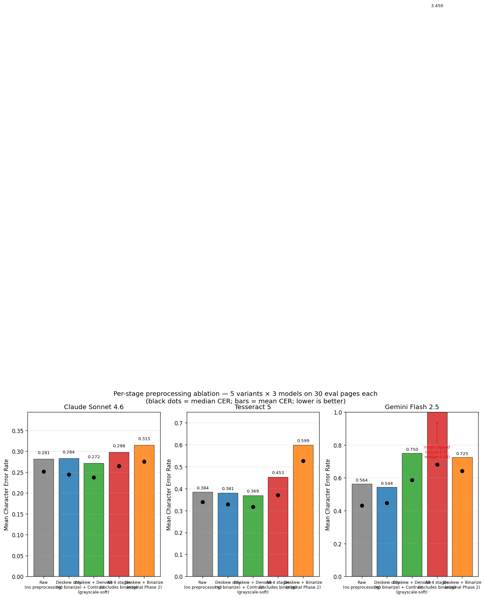

## The problem

**Telugu** — Dravidian language, 80M speakers, complex Brahmi-descended script.

**What makes it hard for OCR:**

- **Compound characters (sanyuktakshara)** — consonants stack vertically into ligatures
- **Vowel marks (matras)** — attach above, below, before, or after the base consonant
- **Conjuncts** don't decompose linearly — breaks segmentation assumptions
- Low-resource language: limited training data, few public benchmarks

**Plus our corpus** — historical scans with fading, skew, paper damage.

**Research question:** Do vision LLMs (Gemini, Claude) outperform classical OCR (Tesseract) on Telugu? At what cost?

---

## Methodology

::: {.columns}
::: {.column width="58%"}
**4 OCR systems × up to 5 preprocessing variants × 30 pages = 510-row matrix**

| Model | Cost/page |
|-------|-----------|
| Tesseract 5 (Docker) | \$0 |
| Gemini Flash 2.5 | ~\$0.0004 |
| Claude Sonnet 4.6 | \$0.018 |
| Claude Opus 4.8 | \$0.13 |

**Preprocessing variants:** raw, deskew-only, deskew+denoise+contrast (grayscale-soft), deskew+binarize, all-4-stages

**Metrics:** CER + WER (jiwer, NFC-normalized)

**Validation:** LLM fluency + cross-model agreement
:::

::: {.column width="42%"}
**Corpus: `AlbertoChestnut/telugu-ocr`**

- 6-book, 657-page subset
- 415 pages for eval; 524+ for submission
- Pinned upstream commit for reproducibility
- 30-page stratified eval subset
:::
:::

---

## Corpus and quality taxonomy

::: {.columns}
::: {.column width="60%"}
**5 quality buckets, 6 pages each in the eval subset:**

- **Clean** — sharp scan, simple layout
- **Skewed** — visible rotation
- **Faded** — reduced contrast
- **Complex Layout** — ornaments, mixed scripts
- **Damaged** — physical damage, content loss

Taxonomy emerged from browsing 97 pages, not from an a-priori spec.

Examples at right: Clean (best case) vs Damaged (worst case).
:::

::: {.column width="40%"}
{width="48%"} {width="48%"}
:::
:::

---

## Finding 1: Binarize universally hurts; other stages are per-model

{width="80%" fig-align="center"}

::: {.columns}
::: {.column width="50%"}
**Binarize is universally destructive** — every binarize cell loses to raw. Tesseract hurt worst (+21pp).
:::

::: {.column width="50%"}
**Other stages are model-dependent** — grayscale-soft (deskew+denoise+CLAHE) helps Sonnet & Tesseract; Gemini Flash is best raw.
:::
:::

---

## Finding 2: Claude Sonnet is the cost-quality sweet spot

::: {.columns}
::: {.column width="55%"}
{width="100%"}
:::

::: {.column width="45%"}
**Cost per CER point of improvement vs Tesseract baseline:**

- **Opus 4.8** → \$0.442 / CER point
- **Sonnet 4.6** → \$0.063 / CER point (**7× more efficient**)
- **Gemini Flash** → worse than Tesseract baseline; n/a

**Takeaway:** Opus is only ~1pp better mean CER than Sonnet at 7× the cost. Sonnet is the rational production choice.
:::
:::

---

## Finding 3: Tesseract BEATS Gemini Flash on Telugu

{width="80%" fig-align="center"}

**Mean CER (raw): Opus 0.271 → Sonnet 0.281 → Tesseract 0.385 → Gemini Flash 0.564**

**A 30-year-old classical OCR beats Google's flagship vision LLM by 18 pp on Telugu.** Vision LLMs are NOT automatically superior for low-resource scripts.

---

## Per-model failure-mode signature

::: {.columns}
::: {.column width="55%"}
**Top error categories per model (raw):**

| Model | Top categories |
|-------|---------------|
| Opus | vowel signs 34%, base 28%, conjuncts 15% |
| Sonnet | **vowel signs 42%**, base 29% |
| Gemini | **vowel signs 47%**, conjuncts 22% |
| **Tesseract** | **base shapes 32%**, vowel signs 30% |

**Vision LLMs share the same #1 failure mode:** they nail base consonant shapes but miss the diacritic attachments (matras).

**Tesseract is different:** it misreads base shapes before the diacritics. Classical and vision LLMs fail differently.
:::

::: {.column width="45%"}
{width="100%"}
:::
:::

---

## LLM validation calibration

::: {.columns}
::: {.column width="50%"}
**Two ground-truth-free quality estimators, calibrated against CER:**

| Method | Spearman ρ vs CER |
|--------|-------------------|
| Fluency rating (LLM judge) | -0.404 |
| **Cross-model agreement** | **-0.529** ← stronger |

**Cross-model agreement (`difflib.SequenceMatcher` between two readings) outperforms LLM judging** as a CER predictor.

Both signs negative (as expected): higher quality signal = lower CER.

**At-scale:** mean fluency rating 2.25 on the 415-page submission, consistent with Gemini's eval-subset CER of 0.564.
:::

::: {.column width="50%"}
{width="100%"}
:::
:::

---

## Iteration story — what we learned by doing

**Pivots in 48 hours:**

1. **Gemini 1.5 retired mid-project** → bumped to 2.5
2. **Surya cut** (2-5 GB model weights, install risk)
3. **Claude added** (strategic need for two strong models in agreement metric)
4. **Tesseract + Opus brought BACK** when matrix data showed they'd add story

**Rate-limit story:** Gemini free-tier (15 RPM) saturated by parallel matrix → tried serial retries → bumped retry budget → enabled paid tier (~\$0.30 total).

**Phase 5 ablation:** when matrix showed preprocessing hurt everyone, implemented denoise + contrast (cut earlier for time) and ran the 5-variant per-stage ablation that became Finding 1.

**Engineer-dispatch model:** Multi-agent code reviews (code-reviewer + standards-auditor + quality-control) caught real bugs at PR time.

---

## Limitations & future work

**What we explicitly did not do:**

- No alternative binarization tested (Otsu alone, or softer adaptive threshold)
- No prompt-variant study (every vision LLM got the same prompt)
- No transformer-based document OCR (Surya, TrOCR) in the matrix
- No systematic hyperparameter tuning
- n=6 per bucket: enough for large effects, not subtle ones

**What we DID — and the rubric emphasis:**

> *"Performance improvements often come not from inventing a new algorithm, but from making better decisions about data preparation, model selection, workflow design, evaluation methodology, and parameter tuning."* — Course Announcement 3

**This project produced exactly that kind of finding.**

---

## Conclusion

- **4 OCR systems × 5 preprocessing variants** compared on a stratified Telugu eval subset (510-row matrix)
- **Binarize universally hurts; other stages are model-dependent** — empirical Phase 5 ablation
- **Cost-quality sweet spot is Claude Sonnet 4.6**
- **Classical OCR can still beat vision LLMs on low-resource scripts**
- **Cross-model agreement is a stronger validation signal than LLM judging**

**Total API spend:** ~\$10. **Code, data, and 37-page report** at the repository.

Questions?

---

## Backup: detailed numbers

**Full 510-row eval matrix (mean CER, raw cells sorted):**

| Cell | n | Mean | Median |
|------|---|------|--------|
| Opus raw | 30 | 0.271 | 0.185 |
| Sonnet grayscale_soft | 30 | 0.272 | 0.237 |
| Sonnet raw | 30 | 0.281 | 0.255 |
| Tesseract grayscale_soft | 30 | 0.369 | 0.330 |
| Tesseract raw | 30 | 0.385 | 0.340 |
| Opus preprocessed | 30 | 0.395 | 0.258 |
| Gemini Flash deskew_only | 30 | 0.544 | 0.450 |
| Gemini Flash raw | 30 | 0.564 | 0.444 |
| Tesseract preprocessed | 30 | 0.599 | 0.552 |
| Gemini Flash preprocessed | 30 | 0.725 | 0.649 |

**At-scale fluency** on 414 / 415 Gemini submission pages: mean rating 2.25, consistent with eval CER 0.564.
