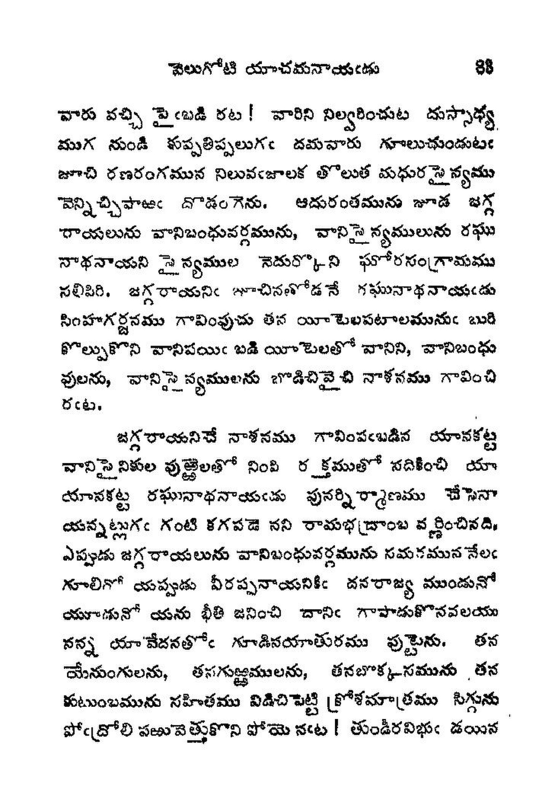
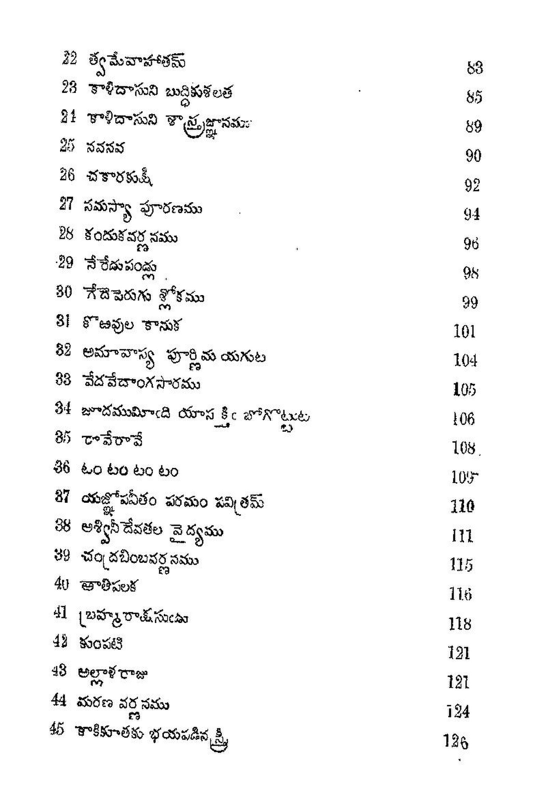
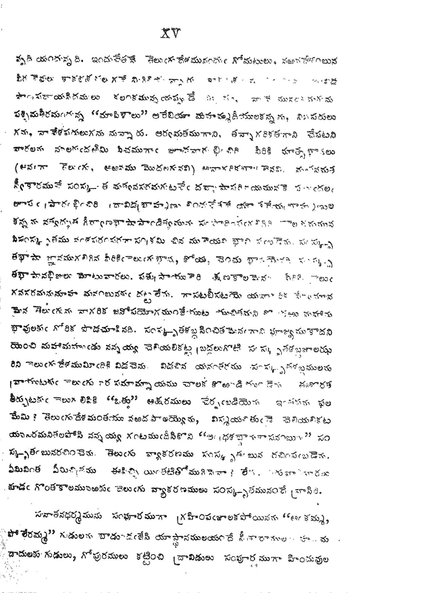
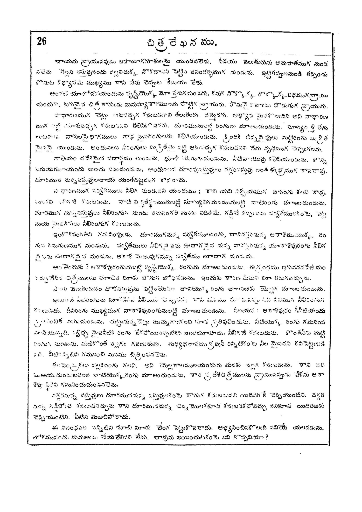
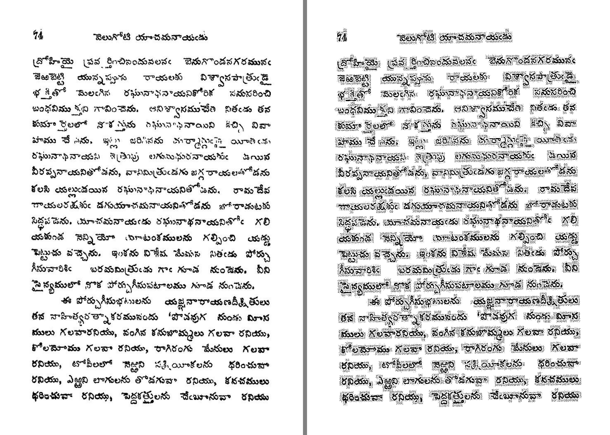
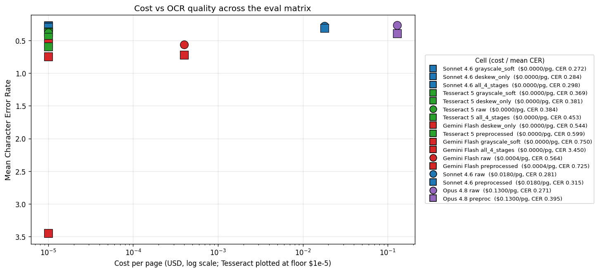
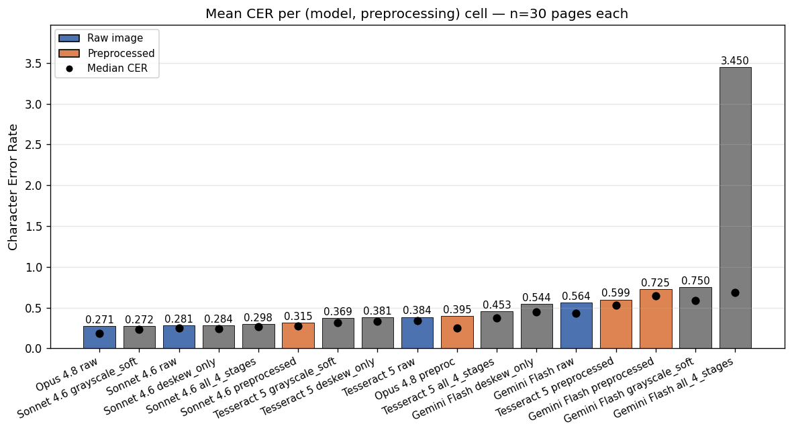
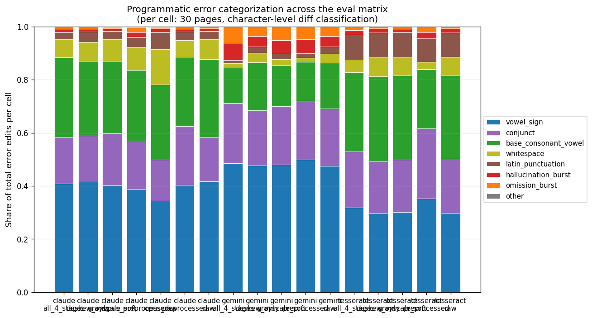
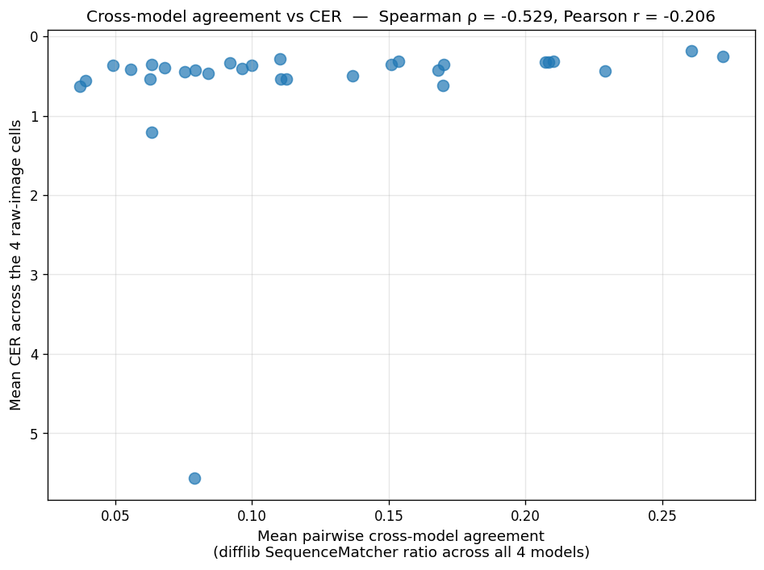

## The problem {.smaller}

**Telugu** — Dravidian language, 80M speakers, complex Brahmi-descended script.

**What makes it hard for OCR:**

- **Compound characters (sanyuktakshara)** — consonants stack vertically into ligatures
- **Vowel marks (matras)** — attach above, below, before, or after the base consonant
- **Conjuncts** don't decompose linearly — breaks segmentation assumptions
- Low-resource language: limited training data, few public benchmarks

**Plus our corpus** — historical scans with fading, skew, paper damage.

**Research question:** Do vision LLMs (Gemini, Claude) outperform classical OCR (Tesseract) on Telugu? At what cost?

---

## Methodology — the comparison matrix

::: {.columns}
::: {.column width="60%"}
**4 OCR systems × 2 preprocessing × 30 pages = 240-row matrix**

| Model | Cost/page |
|-------|-----------|
| Tesseract 5 (Docker) | \$0 |
| Gemini Flash 2.5 | ~\$0.0004 |
| Claude Sonnet 4.6 | \$0.018 |
| Claude Opus 4.8 | \$0.13 |

**Preprocessing:** deskew + adaptive-binarize

**Metrics:** CER + WER (jiwer, NFC-normalized)

**Validation:** LLM fluency + cross-model agreement
:::

::: {.column width="40%"}
**5-book subset of `AlbertoChestnut/telugu-ocr` HuggingFace dataset**

- 415 paired image+text pages
- Pinned upstream commit for reproducibility
- 30-page eval subset (stratified by quality)
:::
:::

---

## Corpus and quality taxonomy

::: {.columns}
::: {.column width="50%"}
**5 quality buckets, 6 pages each in the eval subset:**

- **Clean** — sharp scan, simple layout
- **Skewed** — visible rotation
- **Faded** — reduced contrast
- **Complex Layout** — ornaments, mixed scripts
- **Damaged** — physical damage, content loss

Taxonomy emerged from browsing 97 pages, not from an a-priori spec.
:::

::: {.column width="50%"}
{width="48%"}
{width="48%"}

{width="48%"}
{width="48%"}
:::
:::

---

## Finding 1: Preprocessing hurt EVERY model {.smaller}

::: {.columns}
::: {.column width="50%"}
| Model | Raw CER | Preprocessed | Δ |
|-------|---------|------------|---|
| Sonnet 4.6 | 0.281 | 0.315 | +0.034 |
| Opus 4.8 | 0.271 | 0.395 | +0.124 |
| Gemini Flash | 0.564 | 0.725 | +0.161 |
| **Tesseract** | **0.385** | **0.599** | **+0.214** ← worst hit |

**Root cause:** adaptive binarization collapsed 256-level grayscale to 2-level pure black/white.

**Lesson:** Modern OCR carries tuned internal preprocessing. **Don't compete with it — trust it.**
:::

::: {.column width="50%"}
{width="100%"}

Raw (left): 256 grayscale levels. Preprocessed (right): 2 levels, **0% mid-tones**.
:::
:::

---

## Finding 2: Claude Sonnet is the cost-quality sweet spot

{width="65%" fig-align="center"}

- **Opus 4.8** is only ~1pp better CER than Sonnet, at **7× the cost**
- **Sonnet 4.6** is the rational production choice
- **Gemini Flash** is cheap but ~28pp worse than either Claude

---

## Finding 3: Tesseract BEATS Gemini Flash on Telugu

::: {.columns}
::: {.column width="50%"}
**Mean CER (raw images):**

| Rank | Model | CER |
|------|-------|-----|
| 1 | Claude Opus | **0.271** |
| 2 | Claude Sonnet | 0.281 |
| 3 | **Tesseract 5** | **0.385** ← |
| 4 | Gemini Flash | 0.564 |

**A 30-year-old open-source classical OCR beats Google's flagship vision LLM by 18 percentage points on Telugu.**

Vision LLMs are NOT automatically superior for low-resource scripts.
:::

::: {.column width="50%"}
{width="100%"}
:::
:::

---

## Per-model failure-mode signature {.smaller}

::: {.columns}
::: {.column width="55%"}
**Top error categories per model (raw):**

| Model | Top-3 |
|-------|-------|
| Opus | vowel signs 34%, base consonants 28%, conjuncts 15% |
| Sonnet | **vowel signs 42%**, base consonants 29% |
| Gemini | **vowel signs 47%**, conjuncts 22% |
| **Tesseract** | **base consonants 32%**, vowel signs 30% |

**Vision LLMs share the same #1 failure mode**: they nail the base consonant shapes but miss the diacritic attachments (matras).

**Tesseract is different**: it misreads the base shapes before the diacritics. Classical and vision LLMs fail differently.
:::

::: {.column width="45%"}
{width="100%"}
:::
:::

---

## LLM validation calibration

::: {.columns}
::: {.column width="50%"}
**Two ground-truth-free quality estimators, calibrated against CER:**

| Method | Spearman ρ vs CER |
|--------|-------------------|
| Fluency rating (LLM judge) | **-0.445** |
| **Cross-model agreement** | **-0.586** ← stronger |

**Cross-model agreement (`difflib.SequenceMatcher` between two readings) outperforms LLM judging** as a CER predictor.

Both signs negative (as expected): higher quality signal = lower CER.
:::

::: {.column width="50%"}
{width="100%"}
:::
:::

---

## Iteration story — what we learned by doing

**Pivots in 48 hours:**

1. **Gemini 1.5 retired mid-project** → bumped to 2.5
2. **Surya cut** (2-5 GB model weights, install risk)
3. **Claude added** (strategic need for two strong models in agreement metric)
4. **Tesseract + Opus brought BACK** when matrix data showed they'd add story

**Rate limit story:** Gemini free-tier (15 RPM) was saturated by parallel matrix. Tried serial retries → bumped retry budget → finally enabled paid tier (AI Studio billing, ~\$0.30 total).

**Engineer dispatch model:** Multi-agent code reviews (code-reviewer + standards-auditor + quality-control) caught real bugs at PR time.

---

## Limitations & future work

**What we explicitly did not do:**

- No per-stage preprocessing ablation (deskew-only vs binarize-only)
- No prompt-variant study
- No transformer-based document OCR (Surya, TrOCR)
- No systematic hyperparameter tuning
- n=6 per bucket is enough for large effects, not subtle ones

**What we DID — and the rubric emphasis:**

> *"Performance improvements often come not from inventing a new algorithm, but from making better decisions about data preparation, model selection, workflow design, evaluation methodology."*

— Course Announcement 3.

**This project produced exactly that kind of finding.**

---

## Conclusion {.smaller}

- **4 OCR systems compared** on a stratified Telugu eval subset
- **Preprocessing hurts every model** — even the classical baseline
- **Cost-quality sweet spot is Claude Sonnet 4.6**
- **Classical OCR can still beat vision LLMs on low-resource scripts**
- **Cross-model agreement is a stronger validation signal than LLM judging**

**Total API spend:** ~\$9.20. **Code, data, and 30-page report** at the repository.

**Thanks** to Rauf for the Phase 1 corpus characterization notebook.

Questions?

---

## Backup: detailed numbers

**Full eval matrix (mean CER, sorted):**

| Cell | n | Mean CER | Median |
|------|---|----------|--------|
| Opus raw | 30 | 0.271 | 0.185 |
| Sonnet raw | 30 | 0.281 | 0.255 |
| Sonnet preprocessed | 30 | 0.315 | 0.281 |
| Tesseract raw | 30 | 0.385 | 0.340 |
| Opus preprocessed | 30 | 0.395 | 0.258 |
| Gemini Flash raw | 30 | 0.564 | 0.444 |
| Tesseract preprocessed | 30 | 0.599 | 0.552 |
| Gemini Flash preprocessed | 30 | 0.725 | 0.649 |

**At-scale fluency on 415-page Gemini submission:** mean rating 2.25 → consistent with eval CER of 0.564.
